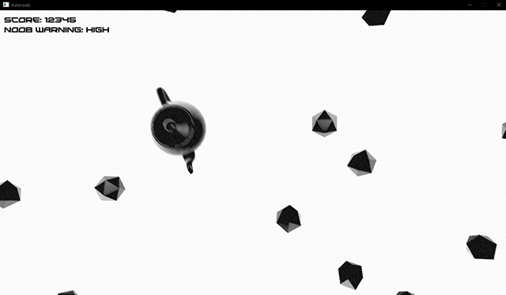
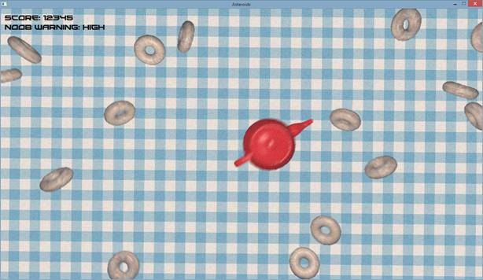

# Attempting the Entity Component System Architectural Pattern in C

This project had several important aspects;

* Learning GLSL
* Understanding the ECS game architecture
* Deepening my knowledge of physics

The goal was to implement a rendering pipeline (using OpenGL), a linear algebra library (specifically for vector and matrix operations), a generalized (though not portable) device input package and a physics simulation.

**Features:**

* File packing and unpacking
* Rigid body physics (using fourth-order Runge Kutta integration)
* GLSL shaders (compiled and run on the GPU)
  * Material shader
  * Noise/fake-ISO shader
  * Motion blur shader
  * Exposure shader
* ECS architecture

Everything was implemented in C, although I did not follow the C89 standard, but rather C99 and even some C11 features (by extension since the MSVC++ compiler is not quite there yet).

### Materials!

Notice the use of ADS (ambient-diffuse-specular) material shaders, a (barely noticeable) noise shader, a motion blur shader as well as an exposure shader for mor realistic colors!

### Textures!

